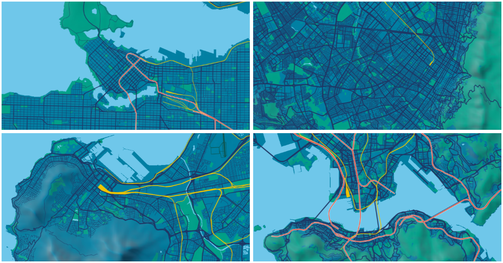

## city-guesser

City-Guesser is a map-based quiz game designed to test one's knowledge of urban form and transportation network structure of cities around the world. 

Play here: http://schoolofcities.github.io/city-guesser/index.html

The game is simple. You are given an unlabeled map, and you have to guess which city it represents. If you guess correctly, you move onto the next round. Each round gets progressively more difficult as more obscure cities are added into the choice set. A level counter and game score is updated each time you guess correctly. If you guess wrong, you have to restart, but a high score is saved for future reference.

The map was designed and built using Mapbox and QGIS, with data from OpenStreetMap and Natural Earth. 

